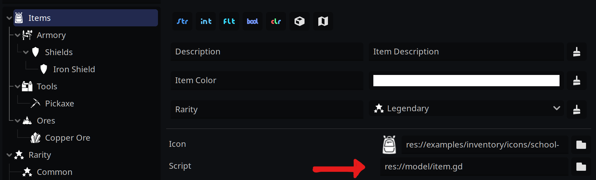

# Custom Scripts

For many cases, the default types **Pandora** comes with are sufficient. However, for larger projects it can become cumbersome to constantly have to cast property values:

```gdscript
var pickaxe = Pandora.get_entity(Items.PICKAXE)
var texture = pickaxe.get_resource("Item Texture") as Texture2D
```
A better solution is to define a custom `Item` type like so (it **must** extend `PandoraEntity`):
```gdscript
class_name Item extends PandoraEntity


func get_item_texture() -> Texture2D:
   return get_resource("Item Texture") as Texture2D
```
Given this script is located inside your project, e.g. `res://model/item.gd` you can define it inside Pandora on your `Items` category:



You can change your above script as such:
```gdscript
var pickaxe = Pandora.get_entity(Items.PICKAXE) as Item
var texture = pickaxe.get_item_texture()
```
There are additional steps you can take to improve the code even further. For example, you could introduce an `ItemRepository` autoload that does something like this:
```gdscript
extends Node

func get_item(id:String) -> Item:
   return Pandora.get_entity(Items.PICKAXE) as Item
```
with which you could change the previous code to:
```gdscript
var texture = ItemRepository.get_item(Items.PICKAXE).get_item_texture()
```